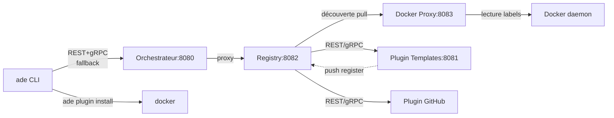

# Architecture des plugins Docker

## Vue d'ensemble

Le système de plugins permet d'étendre les fonctionnalités du CLI et de l'orchestrateur via des conteneurs Docker indépendants. Chaque plugin expose une API REST et gRPC, et est découvert dynamiquement par le service de registre.

## Diagramme d'architecture

## Composants

### Registry (port 8082)
Service autonome qui gère l'enregistrement et le suivi des plugins. Expose une API REST :

| Endpoint | Méthode | Description |
|----------|---------|-------------|
| `/api/v1/plugins` | GET | Liste tous les plugins enregistrés |
| `/api/v1/plugins/{name}` | GET | Détails d'un plugin |
| `/api/v1/plugins/register` | POST | Enregistrement push par un plugin |
| `/api/v1/plugins/{name}` | DELETE | Désenregistrement |

Le registry effectue un health check périodique (toutes les 30s). Après 3 échecs consécutifs, le plugin est automatiquement retiré.

### Docker Proxy (port 8083)
Side-car avec accès Docker socket en lecture seule. Expose une API REST restreinte permettant uniquement de lister les conteneurs par labels. Aucun autre accès Docker n'est exposé.

### Orchestrateur (port 8080)
Proxyfie les appels `/api/v1/plugins/*` vers le registry (port 8082). Le CLI et l'interface web passent par l'orchestrateur.

## Flux d'enregistrement

1. **Push** : Le plugin démarre et s'enregistre via `POST /api/v1/plugins/register` sur le registry
2. **Pull** : Le registry interroge périodiquement le Docker proxy pour détecter les nouveaux conteneurs avec labels `ade.plugin.*`
3. **Health check** : Le registry ping chaque plugin toutes les 30s

## Protocoles supportés

- **REST/HTTP** pour les opérations simples (requêtes synchrones)
- **gRPC** pour les échanges structurés et le streaming

Le CLI essaie d'abord gRPC (port 9090). Si gRPC est indisponible, fallback automatique vers REST (port 8080).

## Dégradation

- CLI et orchestrateur restent fonctionnels sans plugins
- Orchestrateur indisponible → messages informatifs, pas d'erreurs fatales
- Plugin qui ne répond plus → retiré après 3 health checks échoués

## Installation

- **À la volée** : `ade plugin install <image>`
- **Permanent** : via `docker-compose.yml` avec labels `ade.plugin.*`
