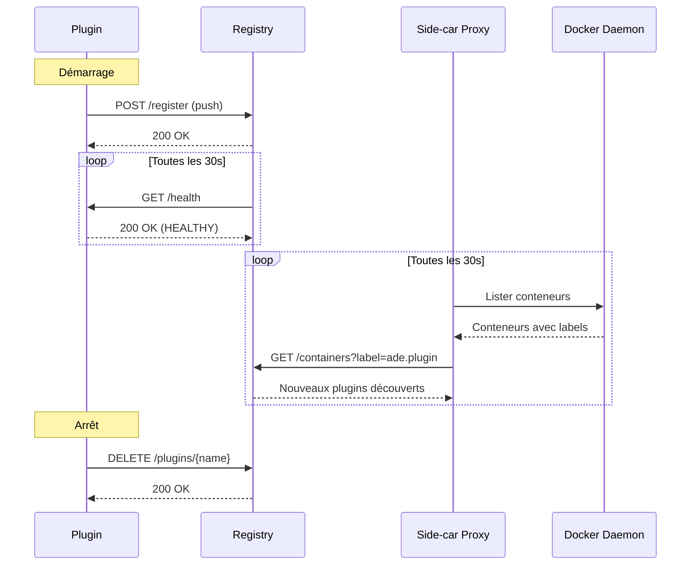

# Découverte et enregistrement des plugins

## Mécanisme push

Le plugin s'enregistre automatiquement auprès du registry via `POST /api/v1/plugins/register`.

Flux :
1. Le plugin démarre et configure son serveur REST + gRPC via le SDK
2. Le SDK appelle `POST /api/v1/plugins/register` sur le registry
3. Le registry stocke les informations du plugin et commence le health checking
4. Le plugin se ré-enregistre périodiquement (toutes les 30s par défaut)

Requête d'enregistrement :

```json
{
    "name": "templates",
    "version": "1.0.0",
    "api_version": "v1",
    "description": "Fournit des templates de projets",
    "http_address": "templates-plugin:8081",
    "grpc_address": "templates-plugin:50051",
    "capabilities": [
        {"name": "template_provider", "description": "Provides templates", "version": "1.0.0"}
    ]
}
```

## Mécanisme pull

Le registry interroge périodiquement le Docker proxy (side-car) pour détecter les nouveaux conteneurs avec les labels `ade.plugin.*`.

### Labels Docker supportés

| Label | Obligatoire | Description |
|-------|-------------|-------------|
| `ade.plugin.name` | Oui | Nom du plugin |
| `ade.plugin.version` | Non | Version du plugin |
| `ade.plugin.http-port` | Non | Port HTTP (défaut: 8081) |
| `ade.plugin.grpc-port` | Non | Port gRPC (défaut: 50051) |

### Exemple de démarrage avec labels

```bash
docker run -d \
  --label ade.plugin.name=templates \
  --label ade.plugin.version=1.0.0 \
  --label ade.plugin.http-port=8081 \
  --label ade.plugin.grpc-port=50051 \
  --network ade-network \
  templates-plugin:latest
```

## Cycle de vie d'un plugin



## Health check

- **Intervalle** : 30s (configurable via `ADE_PLUGIN_HEALTH_INTERVAL`)
- **Timeout** : 5s par requête HTTP vers le plugin
- **Max échecs** : 3 échecs consécutifs → désenregistrement automatique
- **Récupération** : Un health check réussi réinitialise le compteur d'échecs

## Docker Proxy (side-car)

Le Docker Proxy est le seul conteneur avec accès au socket Docker. Il expose :

| Endpoint | Méthode | Description |
|----------|---------|-------------|
| `/containers` | GET | Liste les conteneurs avec filtrage par labels |

Le proxy est en lecture seule et ne permet aucune opération d'écriture sur le daemon Docker.
