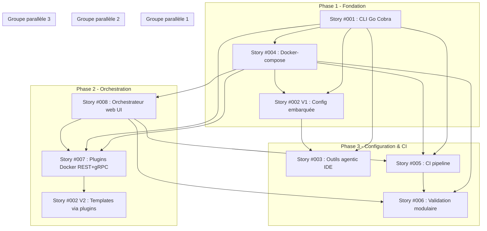

# Plan d'implémentation des stories

## Ordre d'implémentation recommandé

### Phase 1 — Fondation
1. **Story #001** - Initialisation du projet Go CLI (Priorité : Haute)
   - Justification : Aucune dépendance. Structure le projet, définit Cobra et les conventions Go. Bloc de base de tout le reste.

2. **Story #004** - Déploiement docker-compose (Priorité : Haute)
   - Justification : Dépend uniquement de #001. Met en place l'infrastructure Docker qui sera utilisée par tous les composants suivants (plugins, orchestrateur, CI).

3. **Story #002** - Génération des fichiers de configuration (Priorité : Haute)
   - Justification : Dépend de #001 (CLI) et #004 (Docker). V1 avec templates embarqués (`embed`), les templates deviendront dynamiques via plugins dans une phase ultérieure. Produit les fichiers de base (.gitignore, config IDE, skills, docker-compose.yml).

### Phase 2 — Orchestration et plugins
4. **Story #008** - Conteneur orchestrateur avec interface web (Priorité : Haute)
   - Justification : Dépend de #004 (Docker). Cœur de l'architecture : API REST/gRPC + frontend React/Vue. L'orchestrateur est le point central de configuration.

5. **Story #007** - Architecture de plugins Docker (Priorité : Moyenne)
   - Justification : Dépend de #001, #004, #008. Les plugins sont découverts par l'orchestrateur. Le premier plugin d'exemple fournit des templates (permettant d'enrichir #002).

6. **Story #002 (V2)** - Génération via plugins (Priorité : Moyenne)
   - Justification : Après #007, #002 peut être enrichi pour récupérer les templates depuis l'API des plugins au lieu des templates embarqués.

### Phase 3 — Configuration et CI
7. **Story #003** - Configuration outils agentic et IDE (Priorité : Moyenne)
   - Justification : Dépend de #001 et #002. Détection des outils Windows (PATH + chemins par défaut + YAML) et génération des configs IDE.

8. **Story #005** - Architecture CI locale (Priorité : Basse)
   - Justification : Dépend de #001, #004, #008. Architecture agnostique pilotée par plugins, sans moteur CI concret. La fondation est posée, le moteur sera choisi plus tard.

9. **Story #006** - Validation modulaire (Priorité : Basse)
   - Justification : Dépend de #004, #005, #008. Validateurs Go modulaires avec rapports JSON + JUnit XML + visualisation web. Dernière story car elle s'appuie sur l'ensemble de l'infrastructure.

## Stories développables en parallèle

| Groupe | Stories | Condition |
|--------|---------|-----------|
| **Groupe 1** | #002 (V1 templates embarqués) + #004 | #001 complétée. #002 et #004 n'ont pas de dépendance croisée directe (la dépendance #002→#004 est pour les templates via plugins, pas pour la V1). |
| **Groupe 2** | #007 + #008 | #004 complétée. L'orchestrateur et le système de plugins peuvent être développés ensemble car l'orchestrateur définit l'API que les plugins implémentent. |
| **Groupe 3** | #003 + #005 | #002 et #008 complétées. Configuration des outils et architecture CI sont indépendants. |
| **Groupe 4** | #006 | Seule, dépend de tout ce qui précède. |

## Diagramme de dépendances (Mermaid)

## Notes
- **#002 V1 vs V2** : La story #002 est scindée en deux temps : V1 avec templates Go embarqués (`embed`) pour débloquer les dépendances, puis V2 avec templates dynamiques depuis l'API des plugins (#007).
- **REST + gRPC** : Les deux protocoles sont implémentés dès V1 pour l'orchestrateur (#008) et les plugins (#007).
- **CI agnostique** : La story #005 ne choisit pas de moteur CI. Elle définit l'interface et un adaptateur dry-run. Le moteur réel sera implémenté via plugin plus tard.
- **Frontend** : L'interface web de #008 utilise une API Go + frontend React/Vue dans le même conteneur.
- **Windows V1** : Toutes les stories ciblent Windows en priorité, avec une architecture permettant l'extension multi-plateforme à terme.
